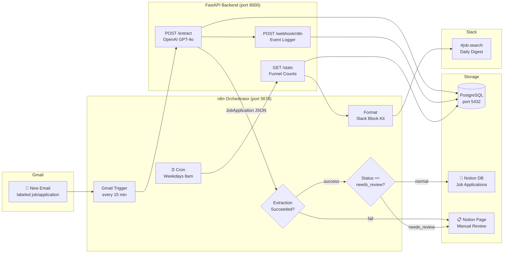

# Job Tracker Agent

An AI-powered job application tracker that monitors Gmail, extracts structured data with GPT-4o, syncs to Notion, and delivers a daily Slack digest — fully automated via n8n.

## Architecture



```
Gmail ──► n8n (poll) ──► POST /extract ──► GPT-4o structured output
                              │
                    ┌─────────┴──────────┐
                    ▼                    ▼
             Notion Upsert        Manual Review Page
             (Applied/Interview   (needs_review / error)
              /Offer/Rejected)
                    │
                   PostgreSQL (source of truth)

Cron (8am weekdays) ──► GET /stats ──► Slack Block Kit digest
```

## Tech Stack

| Layer | Technology |
|---|---|
| Orchestration | n8n (self-hosted) |
| LLM Extraction | OpenAI GPT-4o, structured JSON output |
| Backend | FastAPI 0.111, Python 3.11, asyncpg |
| Data Models | Pydantic v2 |
| Database | PostgreSQL 16 |
| Knowledge Base | Notion API v1 |
| Notifications | Slack Block Kit |
| Infrastructure | Docker Compose |

## Environment Variables

| Variable | Required | Description |
|---|---|---|
| `OPENAI_API_KEY` | ✅ | OpenAI API key |
| `NOTION_TOKEN` | ✅ | Notion integration secret token |
| `NOTION_DATABASE_ID` | ✅ | ID of your "Job Applications" Notion database |
| `NOTION_REVIEW_PAGE_ID` | ✅ | ID of your "Manual Review" Notion page |
| `SLACK_BOT_TOKEN` | ✅ | Slack bot OAuth token |
| `SLACK_CHANNEL` | ✅ | Slack channel (e.g. `#job-search`) |
| `POSTGRES_USER` | ✅ | PostgreSQL username |
| `POSTGRES_PASSWORD` | ✅ | PostgreSQL password |
| `POSTGRES_DB` | ✅ | PostgreSQL database name |
| `N8N_USER` | ✅ | n8n basic auth username |
| `N8N_PASSWORD` | ✅ | n8n basic auth password |
| `N8N_HOST` | optional | Hostname for n8n (default: `localhost`) |
| `FASTAPI_URL` | optional | URL n8n uses to reach FastAPI (default: `http://fastapi:8000`) |

## Setup Guide

### Prerequisites

- Docker Desktop ≥ 24
- `make` (or run commands manually)
- A Gmail account with labels `job` and `application` configured
- A Notion integration with access to your database
- A Slack app with `chat:write` scope

### Step 1 — Clone and configure

```bash
git clone https://github.com/your-username/job-tracker-agent.git
cd job-tracker-agent
cp .env.example .env
# Edit .env and fill in all required values
```

### Step 2 — Start all services

```bash
make dev
```

This starts:
- **PostgreSQL** on `localhost:5432`
- **FastAPI** on `localhost:8000` (API docs at `/docs`)
- **n8n** on `localhost:5678`

### Step 3 — Configure n8n credentials

Open [http://localhost:5678](http://localhost:5678) and add credentials for:

1. **Gmail OAuth2** — Settings → Credentials → New → Gmail OAuth2
2. **Notion API** — Settings → Credentials → New → Notion API (paste your integration token)
3. **Slack API** — Settings → Credentials → New → Slack API (paste your bot token)

### Step 4 — Import workflows

```bash
make import-workflows
```

Then activate both workflows in the n8n UI (toggle the switch on each workflow card).

### Step 5 — Label emails in Gmail

Create Gmail labels named `job` and `application`. Apply them to any job-related emails. The trigger polls every 15 minutes for unread emails with these labels.

### Step 6 — Set up Notion

Create a database in Notion with these properties:

| Property | Type |
|---|---|
| Company | Title |
| Job Title | Text |
| Status | Select (Applied, Interview, Offer, Rejected, needs_review) |
| Date Applied | Date |
| Next Action | Text |
| Recruiter | Text |
| Salary Range | Text |
| Email ID | Text |

Share the database with your integration. Copy the database ID from the URL and set `NOTION_DATABASE_ID` in `.env`.

Create a separate "Manual Review" page, share it with the integration, and set `NOTION_REVIEW_PAGE_ID`.

## API Reference

### `POST /extract`

Receives a raw email and returns structured job application data.

**Request:**
```json
{
  "email_id": "18f3a2b1c4d5e6f7",
  "subject": "Your application to Stripe",
  "sender": "recruiting@stripe.com",
  "body": "Hi Sanidhya, we received your application for..."
}
```

**Response:**
```json
{
  "success": true,
  "application": {
    "company_name": "Stripe",
    "job_title": "ML Engineer",
    "status": "Applied",
    "date_applied": "2026-04-21",
    "next_action": "Wait for recruiter follow-up",
    "recruiter_name": null,
    "salary_range": null,
    "confidence": 0.91
  },
  "routed_to_review": false
}
```

### `GET /stats`

Returns funnel counts for the Slack digest.

```json
{
  "applied": 42,
  "interview": 11,
  "offer": 2,
  "rejected": 18,
  "needs_review": 3,
  "total": 76,
  "response_rate": 0.3095,
  "offer_rate": 0.0476
}
```

### `POST /webhook/n8n`

Receives execution event logs from n8n. Used for observability.

## How LLM Extraction Works

```
Email (subject + body)
        │
        ▼
  System prompt (prompts/extract_job_email.txt)
        │
        ▼
  GPT-4o (response_format: json_object, temp=0.1)
        │
        ▼
  Parse JSON → validate with Pydantic
        │
  confidence < 0.7?
   ├── YES → status = needs_review → Notion Manual Review page
   └── NO  → upsert to Notion DB + PostgreSQL
```

The prompt instructs the model to be conservative with confidence scores. Anything ambiguous (newsletters, generic HR emails, promotional content) gets routed to manual review rather than silently creating a bad record.

## Slack Digest Preview

```
📋 Job Search Daily Digest

Today's snapshot — Mon Apr 21 2026
────────────────────────────────────
📨 Applied    🎤 Interview    🎉 Offer    ❌ Rejected
    42              11            2           18

📊 Response Rate    ✅ Offer Rate
      30.9%             4.8%

⚠️ 3 email(s) need manual review — check your Notion review page.

Powered by Job Tracker Agent 🤖
```

## Project Structure

```
job-tracker-agent/
├── workflows/
│   ├── job_tracker_main.json   # Gmail → Extract → Notion (runs every 15 min)
│   └── daily_digest.json       # Cron → /stats → Slack (weekdays 8am)
├── backend/
│   ├── main.py                 # FastAPI app, routes, DB bootstrap
│   ├── extractor.py            # OpenAI GPT-4o structured extraction
│   ├── notion_client.py        # Notion API upsert/review routing
│   ├── models.py               # Pydantic v2 models
│   ├── Dockerfile              # Python 3.11-slim image
│   └── requirements.txt
├── prompts/
│   └── extract_job_email.txt   # System prompt for email parsing
├── screenshots/                # Add UI screenshots here
├── docker-compose.yml
├── .env.example
├── Makefile
└── README.md
```

## Make Commands

| Command | Description |
|---|---|
| `make dev` | Build and start all services in detached mode |
| `make down` | Stop all services |
| `make logs` | Stream logs from all containers |
| `make import-workflows` | Import workflow JSONs into n8n via API |
| `make test` | Run tests inside the FastAPI container |
| `make clean` | Stop services and remove all volumes |

## Screenshots

> Add screenshots to the `screenshots/` folder and link them here.

- `screenshots/n8n_main_workflow.png` — Main workflow canvas
- `screenshots/notion_database.png` — Notion Job Applications database
- `screenshots/slack_digest.png` — Daily Slack digest message
- `screenshots/fastapi_docs.png` — FastAPI `/docs` UI

## License

MIT
